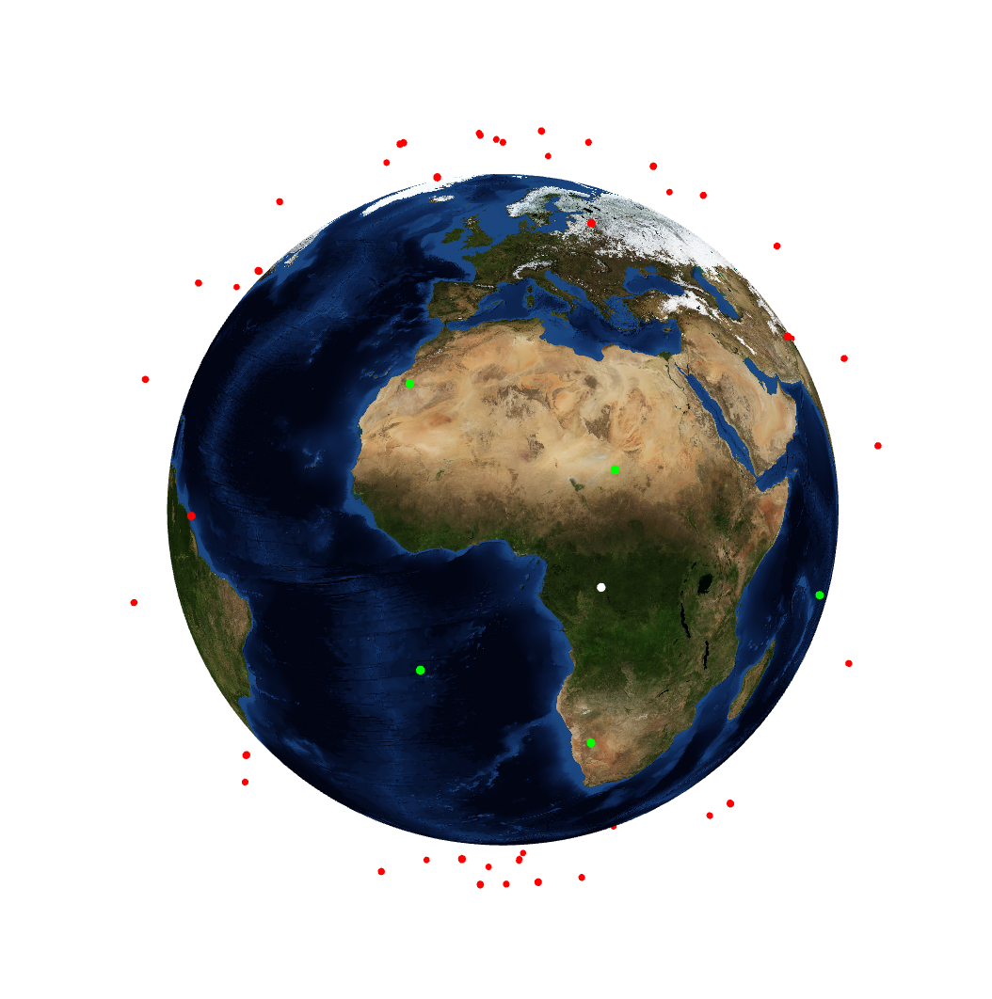

# attenuationCalc
CLI app to calculate the free space path loss between a satellite and several relays.

Developed on my spare time for the CentraleSupelec Center for CubeSats. The application can automatically fetch TLE data for a constellation of satellites, then predict their trajectory and compute the attenuation of a signal between a satellite with an arbitrary trajectory and the constellation.

In red, the satellites of the constellation that are not visible to the satellite of interest, in green those that are visible and in white the satellite of interest. This visualisation is based on opengl and is interactive, the user can move the 3D view and the satellites move along their orbits.

## Installation
`pip install -r requirements.txt`
